# AgentMesh Architecture

This document is the authoritative technical reference for the AgentMesh v1 design. It covers every subsystem in production depth: data models, concurrency guarantees, security invariants, and the precise request lifecycle from TCP accept to upstream response.

---

## Table of Contents

1. [System Overview](#1-system-overview)
2. [Package Dependency Graph](#2-package-dependency-graph)
3. [Full Request Lifecycle](#3-full-request-lifecycle)
4. [Auth & Tenant Isolation](#4-auth--tenant-isolation)
5. [Guardrail Layer](#5-guardrail-layer)
6. [Semantic Cache Layer](#6-semantic-cache-layer)
7. [Budget Enforcement Layer](#7-budget-enforcement-layer)
8. [Reverse Proxy Layer](#8-reverse-proxy-layer)
9. [OpenTelemetry Instrumentation](#9-opentelemetry-instrumentation)
10. [Configuration & Startup](#10-configuration--startup)
11. [Memory & Allocation Strategy](#11-memory--allocation-strategy)
12. [Security Model](#12-security-model)
13. [V1 Constraints & V2 Roadmap](#13-v1-constraints--v2-roadmap)

---

## 1. System Overview

AgentMesh is a **middleware fabric** — not merely a reverse proxy. A reverse proxy forwards traffic. AgentMesh intercepts, analyses, guards, caches, accounts, and only then forwards — or answers from cache without ever touching the upstream.

```mermaid
graph TB
    subgraph Callers
        A1[Agent / App 1<br/>Bearer am_key_acme]
        A2[Agent / App 2<br/>Bearer am_key_beta]
    end

    subgraph AgentMesh Process
        direction TB
        AUTH[AuthMiddleware<br/>O(1) tenant lookup]
        OTEL[OTel Span<br/>otelhttp.NewHandler]
        GRD[GuardrailMiddleware<br/>body limit · stream block · loop breaker]
        CACHE[CacheMiddleware<br/>embed → search → HIT or MISS]
        BUDGET[BudgetMiddleware<br/>pre-flight check · post-flight record]
        PROXY[HandleProxy<br/>credential swap · ReverseProxy]
    end

    subgraph External Services
        REDIS[(Redis<br/>budget counters)]
        QDRANT[(Qdrant<br/>vector index)]
        EMBED[Embeddings API<br/>text-embedding-3-small]
        LLM[Upstream LLM<br/>OpenAI / Azure / vLLM]
        OTLP[OTLP Collector<br/>traces]
    end

    A1 -->|POST /v1/chat/completions| AUTH
    A2 -->|POST /v1/chat/completions| AUTH
    AUTH --> OTEL --> GRD --> CACHE --> BUDGET --> PROXY

    CACHE -->|Search| QDRANT
    CACHE -->|Embed| EMBED
    CACHE -->|async Store on miss| QDRANT
    BUDGET -->|IsBudgetExceeded| REDIS
    BUDGET -->|async RecordUsage| REDIS
    PROXY -->|Bearer real-key| LLM
    AUTH -.->|traces| OTLP
```

The middleware chain is assembled once at startup by `RegisterChain` and is **immutable** during serving. Every layer is a plain `func(http.Handler) http.Handler` value — Go's standard middleware contract.

---

## 2. Package Dependency Graph

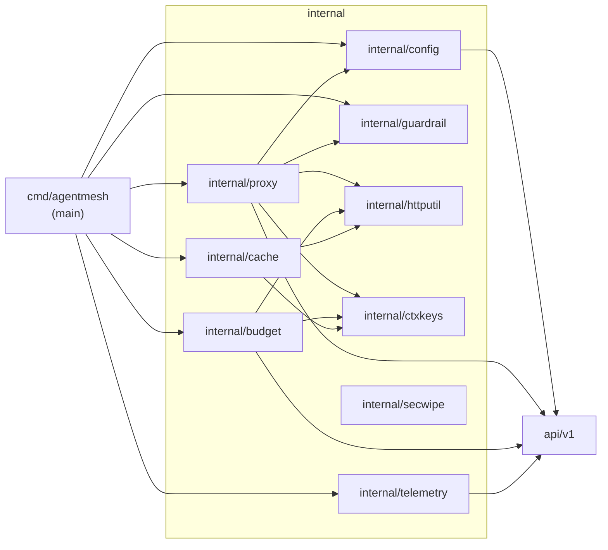

**Dependency rules enforced by the compiler:**
- `internal/ctxkeys` has zero internal imports — it is the foundation layer
- `internal/httputil` has zero internal imports
- `internal/guardrail` has zero internal imports
- `internal/cache` depends only on `ctxkeys` and `httputil` — it cannot import `proxy` or `budget`
- `internal/budget` depends only on `apiv1`, `ctxkeys`, and `httputil`

This layering ensures that the cache middleware can be tested in full isolation without pulling in the proxy or budget subsystems.

---

## 3. Full Request Lifecycle

### 3.1 Cache Miss (normal request)

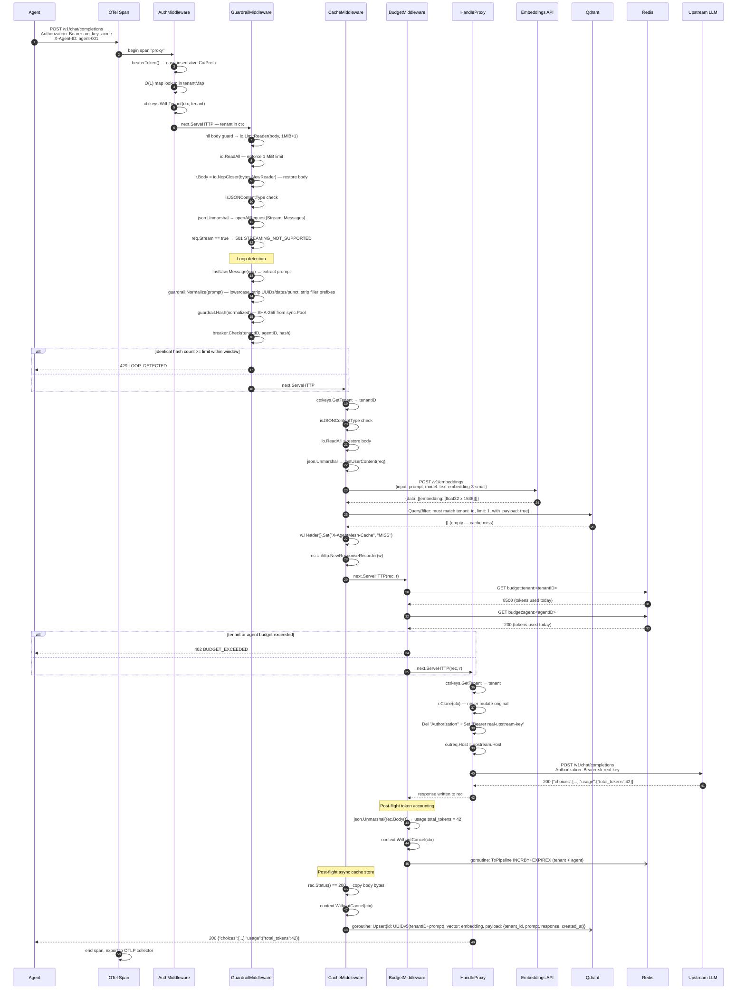

### 3.2 Cache Hit (zero-cost path)

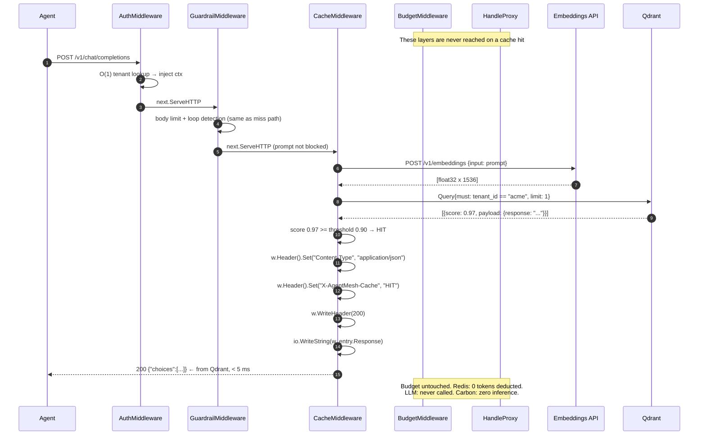

---

## 4. Auth & Tenant Isolation

### 4.1 Credential flow

```mermaid
flowchart LR
    subgraph "Inbound (agent-facing)"
        IK[am_live_acme_abc123<br/>inbound API key]
    end

    subgraph "AgentMesh Memory"
        TM["tenantMap\nmap[inboundKey → *TenantConfig"]
        UM["upstreamKeyMap\nmap[TenantID → upstreamKey"]
    end

    subgraph "Outbound (LLM-facing)"
        UK[sk-real-openai-key<br/>upstream API key]
    end

    IK -->|Bearer header| TM
    TM -->|O(1) lookup, inject ctx| UM
    UM -->|credential swap in Clone| UK

    style IK fill:#ffeeba
    style UK fill:#d4edda
    style TM fill:#cce5ff
    style UM fill:#cce5ff
```

Both maps are written **once** during `NewServer` and are read-only for the entire lifetime of the process. No mutex is needed — Go's memory model guarantees visibility of writes before a goroutine is started.

### 4.2 Key redaction

`config.buildTenantMap` performs irreversible redaction before the config is used anywhere:

```
TenantConfig.APIKey         → "[REDACTED]"
TenantConfig.UpstreamAPIKey → "[REDACTED]"
LoadedConfig.UpstreamKeyMap[TenantID] = <real key>  (never logged)
```

No sensitive credential ever appears in a `slog` call.

### 4.3 Bearer token parsing

```go
// case-insensitive: "bearer ", "Bearer ", "BEARER " all accepted
if !strings.HasPrefix(strings.ToLower(hdr), "bearer ") {
    return ""
}
return strings.TrimSpace(hdr[7:])
```

The original casing of the token itself is preserved (only the prefix is lowercased).

---

## 5. Guardrail Layer

### 5.1 Prompt normalisation pipeline

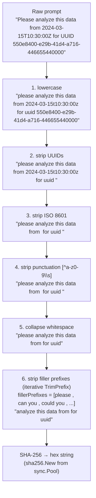

**Critical design constraint:** Filler stripping uses `strings.TrimPrefix` in a loop — NOT a global string replacer. This ensures that the word "please" appearing mid-sentence (e.g., "help me analyze, please") is **not** stripped.

### 5.2 Sliding-window circuit breaker

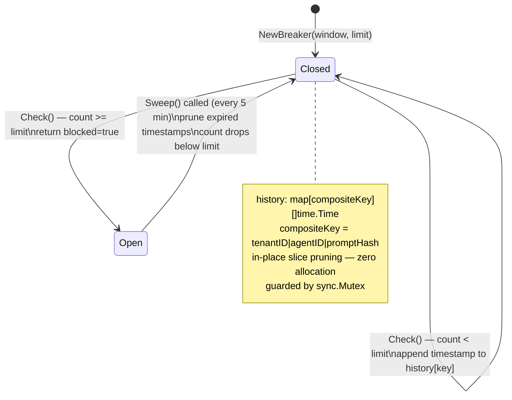

The composite key `tenantID|agentID|hash` means the same agent repeatedly sending the same prompt trips the breaker, while different agents sending the same prompt do **not** interfere with each other's budgets.

---

## 6. Semantic Cache Layer

### 6.1 Component hierarchy

```mermaid
classDiagram
    class Embedder {
        <<interface>>
        +Embed(ctx, text) ([]float32, error)
    }

    class VectorStore {
        <<interface>>
        +Search(ctx, tenantID, embedding, threshold) (*CacheEntry, bool, error)
        +Store(ctx, entry, embedding) error
    }

    class CacheEntry {
        +TenantID string
        +Prompt string
        +Response string
        +CreatedAt time.Time
    }

    class NoopEmbedder {
        +Embed() []float32{0.1, 0.2, 0.3}
    }

    class OpenAIEmbedder {
        -client *http.Client
        -endpoint string
        -apiKey string
        -model string
        +Embed(ctx, text) ([]float32, error)
    }

    class QdrantStore {
        -client *qdrant.Client
        -collectionName string
        +Search(ctx, tenantID, embedding, threshold) (*CacheEntry, bool, error)
        +Store(ctx, entry, embedding) error
    }

    class Config {
        +SimilarityThreshold float32
    }

    Embedder <|.. NoopEmbedder
    Embedder <|.. OpenAIEmbedder
    VectorStore <|.. QdrantStore
    VectorStore ..> CacheEntry
```

### 6.2 Qdrant point schema

Each cached prompt is stored as a single Qdrant point:

| Field | Type | Value |
|---|---|---|
| `id` | UUID | `UUIDv5(NameSpaceURL, tenantID+prompt)` — deterministic, idempotent |
| `vector` | `[]float32` | Output of `text-embedding-3-small` (1536 dimensions) |
| `payload.tenant_id` | string | Tenant identifier |
| `payload.prompt` | string | Original user prompt |
| `payload.response` | string | Full upstream JSON response (raw bytes) |
| `payload.created_at` | string | RFC3339 UTC timestamp |

**Idempotency:** UUIDv5 is derived deterministically from `tenantID+prompt`. Upserting the same prompt twice overwrites rather than duplicates — critical for correctness in concurrent deployments.

### 6.3 Tenant isolation invariant

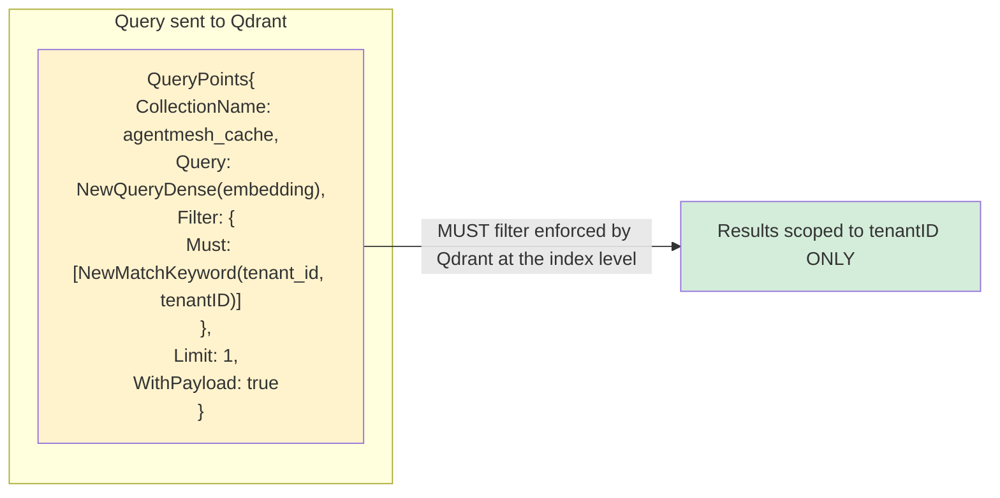

The `Must` filter is not advisory — Qdrant evaluates it before scoring. It is structurally **impossible** for tenant A's cache entry to be returned in a query for tenant B. This is zero-trust isolation at the storage layer.

### 6.4 Asynchronous store with body copy safety

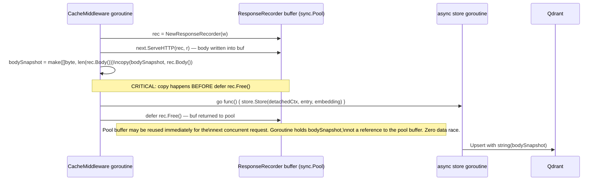

Without the explicit `copy`, the goroutine would hold a slice backed by the pool buffer. When `rec.Free()` returns that buffer to the pool, the next `NewResponseRecorder` call resets and reuses it — silently corrupting the goroutine's data under load.

---

## 7. Budget Enforcement Layer

### 7.1 Eventual consistency model

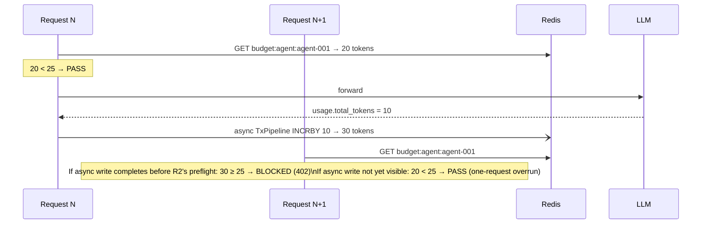

This is the **intentional v1 tradeoff**: recording happens post-flight because the token count is not known until the upstream responds. A single request may exceed the limit by the cost of one request. V2 will pre-authorise token reservations.

### 7.2 Redis key design

```
budget:tenant:<TenantID>   →  INCRBY  +  EXPIREX 48h
budget:agent:<AgentID>     →  INCRBY  +  EXPIREX 48h
```

`EXPIREX` (set TTL only if not already set) prevents concurrent requests from resetting the 48-hour window. Combined with `MULTI/EXEC` (`TxPipeline`):

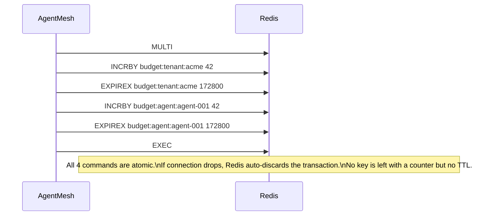

### 7.3 Failure modes

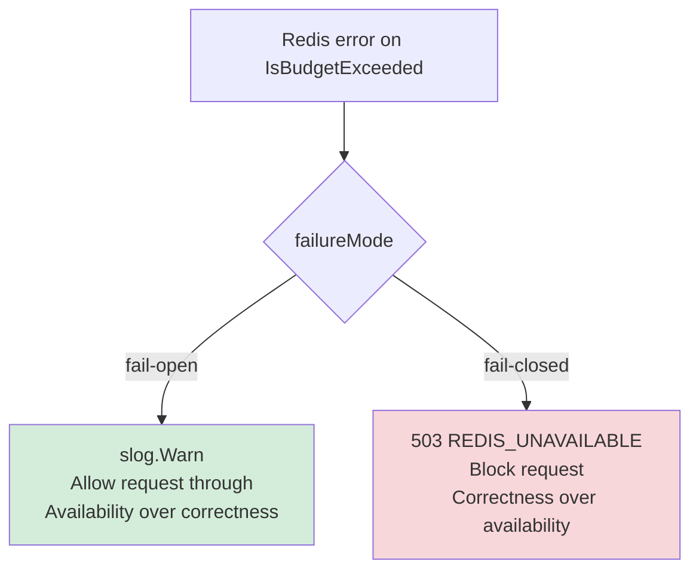

---

## 8. Reverse Proxy Layer

### 8.1 Request mutation safety

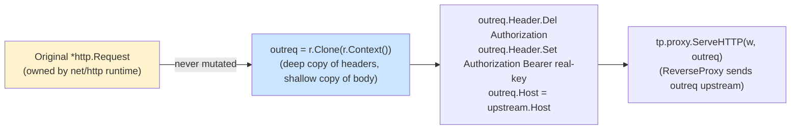

`r.Clone` creates a shallow copy. Headers are deep-copied. The body is shared but the `GuardrailMiddleware` has already replaced it with a fresh `io.NopCloser(bytes.NewReader(...))` — both the original and clone read from the same in-memory bytes, which is safe because the body is only read once.

### 8.2 Upstream connection pool

Each tenant gets one `*httputil.ReverseProxy` instance, created at startup and reused for all requests. `ReverseProxy` internally uses `http.DefaultTransport` which maintains a persistent connection pool with:
- Keep-alive connections
- Configurable `MaxIdleConnsPerHost`
- Automatic retry on connection reset (idempotent requests)

---

## 9. OpenTelemetry Instrumentation

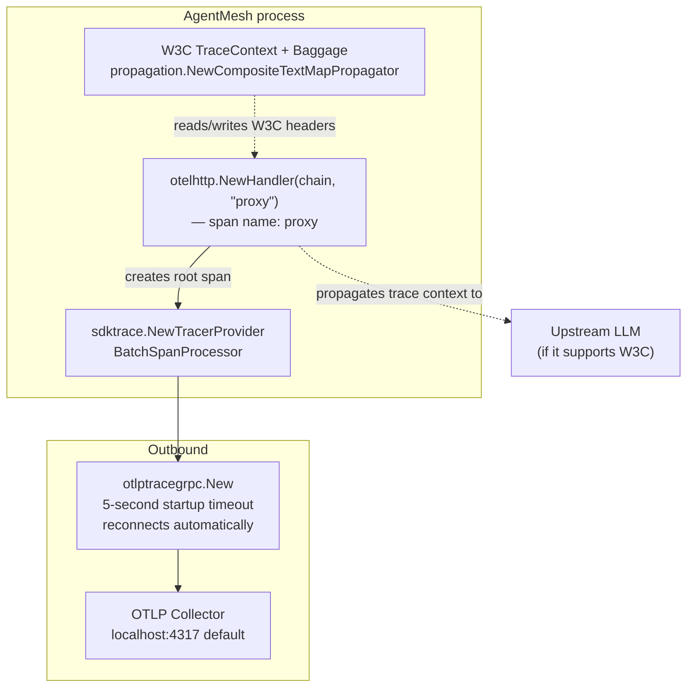

**Startup resilience:** `otlptracegrpc.New` is wrapped in a `context.WithTimeout(ctx, 5s)`. If the OTLP collector is not yet ready (common in Kubernetes before the sidecar starts), AgentMesh starts normally and the SDK retries the connection in the background. Spans are buffered in memory until export succeeds.

---

## 10. Configuration & Startup

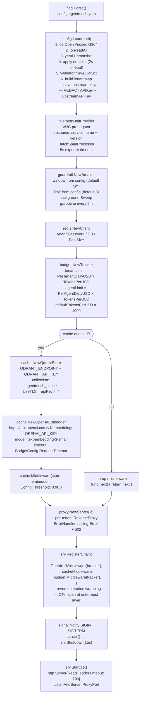

---

## 11. Memory & Allocation Strategy

AgentMesh is designed for the hot path to allocate as little as possible.

### sync.Pool usage

| Pool | Type | Location | Reuse |
|---|---|---|---|
| `bufPool` | `*bytes.Buffer` | `internal/httputil/recorder.go` | Response body capture per request |
| `hashPool` | `hash.Hash` (SHA-256) | `internal/guardrail/normalizer.go` | Prompt hashing per request |

**Pool correctness contract:** A buffer acquired from `bufPool` must be `Reset()` before use and `Put()` after — never after any goroutine holds a reference to its backing array. In `CacheMiddleware`, the body is `copy`'d into a new slice before the recorder is freed.

### In-place slice operations

The circuit breaker's `Check` and `Sweep` methods prune expired timestamps in-place:

```go
// in-place filter — reuses the backing array, zero new allocations
valid := 0
for _, t := range times {
    if now.Sub(t) < b.window {
        times[valid] = t
        valid++
    }
}
b.history[k] = times[:valid]
```

---

## 12. Security Model

### Threat matrix

| Threat | Mitigation |
|---|---|
| Credential exposure in logs | `buildTenantMap` redacts all keys to `[REDACTED]` before any logging |
| Credential exposure via config dump | Same redaction; `UpstreamKeyMap` lives only in memory |
| Cross-tenant cache poisoning | Qdrant `Must` filter on `tenant_id` — enforced at index, not application layer |
| Prompt injection via JSON | `encoding/json` marshal/unmarshal everywhere; no string concatenation for JSON construction |
| Body-based DoS | `io.LimitReader(body, 1 MiB + 1)` hard limit; rejected before any parsing |
| Slowloris | `ReadHeaderTimeout: 10s` on `http.Server` |
| Embedding API abuse | Per-request `http.Client{Timeout}` prevents hanging embedding calls |
| OTLP startup block | `context.WithTimeout(5s)` prevents boot failure when collector is absent |
| Loop abuse / prompt replay | Sliding-window circuit breaker trips after N identical hashes within window |
| Streaming exfiltration | `stream: true` rejected with `501 STREAMING_NOT_SUPPORTED` |
| SQL/NoSQL injection via Redis keys | Keys are built from `keyPrefixTenant + tenantID` — no user-controlled interpolation reaches the key path |

### OWASP alignment

| OWASP Top 10 | Status |
|---|---|
| A01 Broken Access Control | Bearer auth with O(1) tenant map; no token reuse across tenants |
| A02 Cryptographic Failures | No secrets stored; all keys in memory only; TLS enforced when API key present |
| A03 Injection | JSON marshal/unmarshal throughout; no format-string or concatenation-based JSON |
| A04 Insecure Design | Zero-trust tenant isolation at every layer |
| A05 Security Misconfiguration | `#nosec G304` annotated; `ReadHeaderTimeout` set; TLS auto-enabled |
| A06 Vulnerable Components | `go mod tidy` + dependabot recommended |
| A07 Auth Failures | 401 on missing/invalid Bearer; constant-time map lookup |
| A09 Security Logging | Structured JSON slog; no sensitive values in any log call |

---

## 13. V1 Constraints & V2 Roadmap

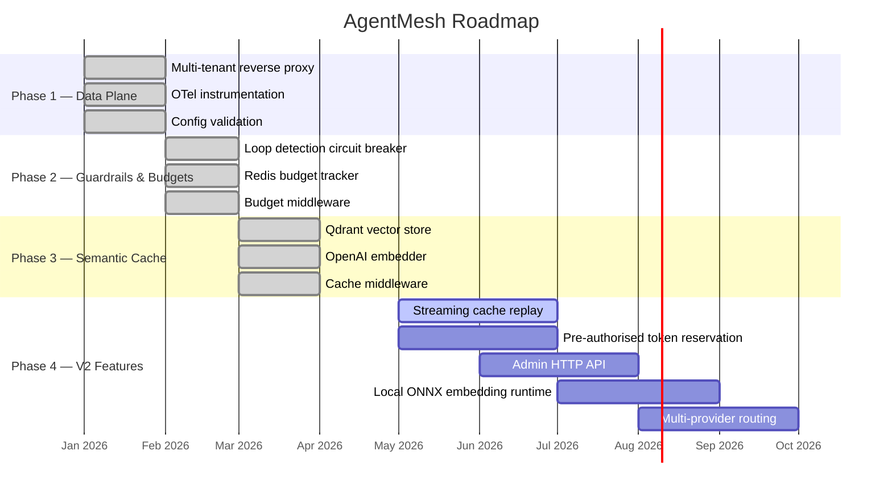

| V1 Constraint | Root cause | V2 approach |
|---|---|---|
| `stream: true` → 501 | `ResponseRecorder` must buffer the full body to inspect tokens; streaming bypasses this | Chunked-transfer cache replay; token counting via SSE event parser |
| One-request budget overrun | Token cost not known until upstream responds | Pre-authorised reservation: `INCRBY estimatedTokens` pre-flight, adjust post-flight |
| `text-embedding-3-small` hardcoded | Single embedder per deployment | Config-driven model selection; local ONNX runtime for air-gapped deployments |
| No admin API | AdminPort reserved but unimplemented | Separate `http.Server` on AdminPort; tenant CRUD, budget reset, cache eviction endpoints |
| Single binary | Sufficient for v1 | Optional: separate control plane + data plane for horizontal scaling |
